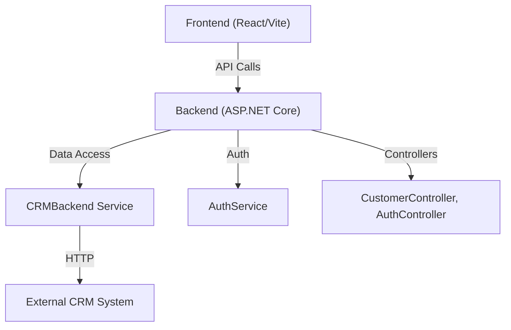
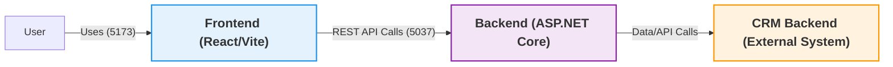
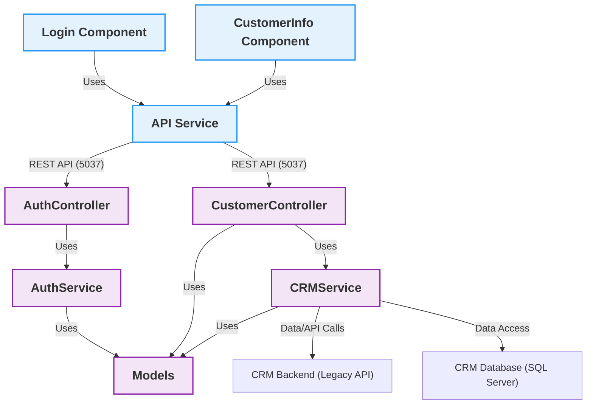
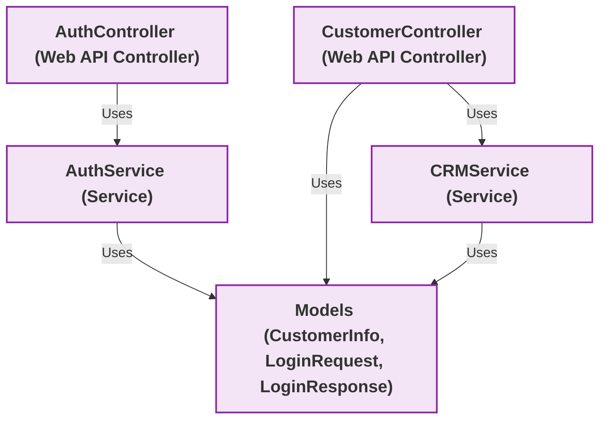

# CRMWebSpa Architecture

## Overview
CRMWebSpa is a modern web application with a React (Vite) frontend and an ASP.NET Core backend. It is designed for modularity, scalability, and ease of deployment on IIS or local development environments.

## High-Level Architecture
- **Frontend:** React (TypeScript) with Vite for fast development and builds.
- **Backend:** ASP.NET Core 8.0 Web API.
- **Deployment:** IIS for production, Vite dev server for local development.
- **Communication:** RESTful API (JSON over HTTP).

## Module Diagram

Below is a Mermaid diagram showing the main modules and their relationships:

 

---

## Key Modules
- **Frontend:**
  - Components: Login, CustomerInfo, etc.
  - Services: API abstraction
- **Backend:**
  - Controllers: AuthController, CustomerController
  - Services: AuthService, CRMService
  - Models: CustomerInfo, LoginRequest, LoginResponse

---

## C4 Diagrams

### C4 Level 1: Context Diagram

### C4 Level 2: Container Diagram

### C4 Level 3: Component Diagram (Backend)

